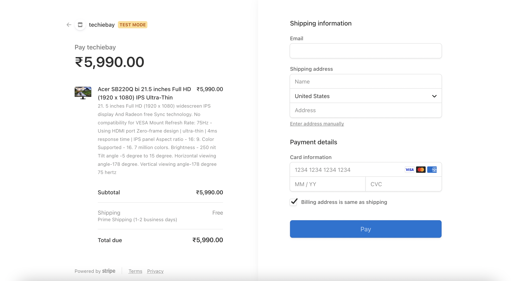

<h1 align="center">
  Techiebay
</h1>

  
  
  
  
  
  

> An Amazon clone created by **McTechie** 👨‍🎨✨

### Concepts Covered

- [x] Server-Side Rendering (NextJS)
- [x] Client-Side Rendering (SWR)
- [x] Redux Toolkit
- [x] Google OAuth Authentication (NextAuth) 
- [x] Stripe Checkouts
  - [x] Stripe Client
  - [x] Stripe CLI
  - [x] Stripe Webhooks
- [x] Firebase V9
  - [x] Service Accounts (Node.js)
  - [x] Client Apps (Web)
  - [x] Subcollections
- [x] APIs
- [x] Animations (Framer Motion)
- [x] Code-Splitting
- [x] Image Optimization

---

### Overview

> To view more images of the build:
> - [Landing Screen](readme-utils/LandingScreen.md)
> - [Checkout Screen](readme-utils/CheckoutScreen.md)
> - [Product Preview Screen](readme-utils/PreviewScreen.md)

#### Landing Page
  
  

---

#### Product Preview
  
  

---

#### Checkout Page
  
  

---

#### Stripe Checkout Session
  
  

---

#### Orders Page

  

---